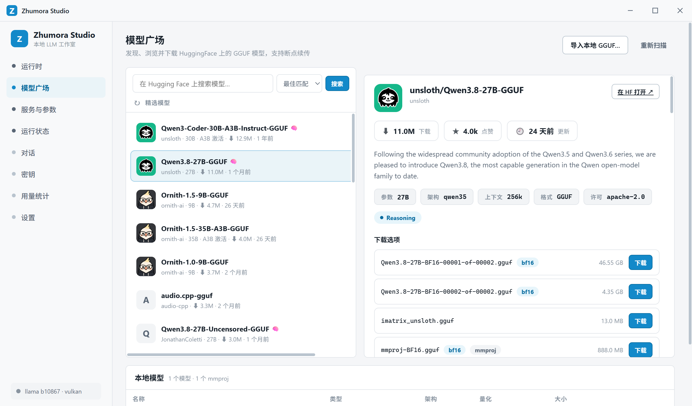
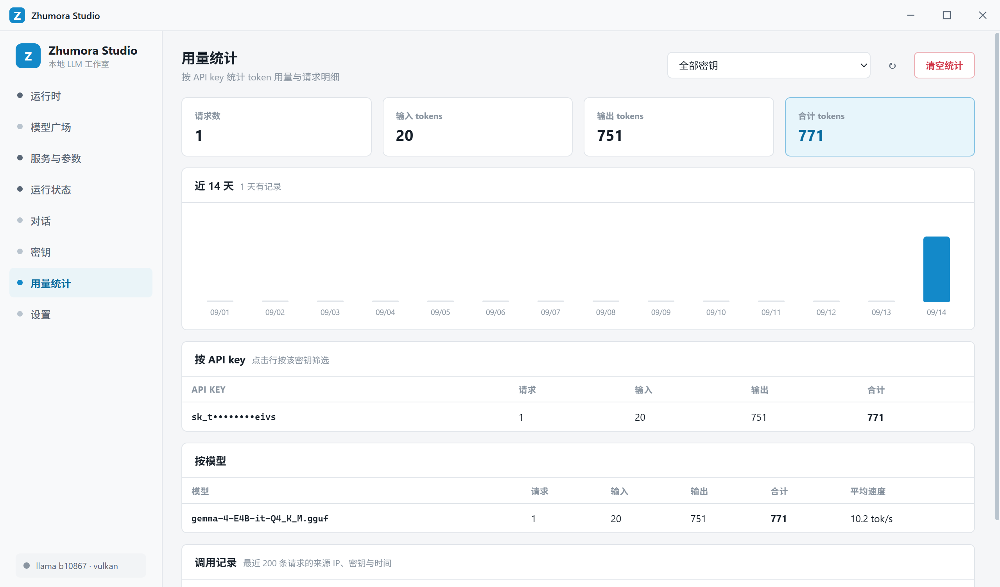

# Zhumora Studio

跨平台（Windows / Linux / macOS）的本地 LLM 工作室 — 基于 Electron + React 的 llama.cpp `llama-server` 可视化管理器。

Zhumora Studio 自动为你的 GPU 下载合适的 llama.cpp 构建，管理你的 GGUF 模型库，并把所有启动参数变成表单。它提供一个本地 OpenAI 兼容 API，可供其他应用调用，并记录它服务的每一次请求。

[English](./README.en.md) · [技术文档](./ARCHITECTURE.md) · [开发指南](./DEVELOPMENT.md)

<p align="center">
  
</p>

## 功能特性

- **运行时管理** — 自动检测 GPU，下载匹配的 llama.cpp 构建（CUDA / Vulkan / CPU），支持校验与断点续传
- **模型广场** — 在应用内搜索 Hugging Face 上的 GGUF 模型，查看量化与元数据，带进度下载；支持导入本地 `.gguf` 文件
- **可视化启动参数** — `llama-server` 的每个参数（上下文、线程、GPU 层数、采样、模板、附加参数）都以分组表单呈现，无需记忆命令行
- **OpenAI 兼容 API** — 提供带 API key 管理的本地端点，任何外部应用都可以调用
- **实时运行状态** — 服务健康、进程与系统 CPU/内存、GPU 占用一目了然
- **对话** — 内置 OpenAI 兼容聊天，支持流式输出、会话管理与 token 速度
- **用量统计** — 记录每次请求（IP、密钥、模型、tokens、耗时），提供按天、按模型、按密钥的明细
- **亮 / 暗主题与多语言界面** — 英文、中文、日本語、Español、Français、Deutsch

## 模型广场

在应用内直接搜索 Hugging Face，选择量化版本，下载到本地模型库。本地模型在启动时自动扫描，架构与量化信息从 GGUF 文件头解析。

<p align="center">
  
</p>

## 用量统计

内置反向代理会记录每一次请求——包括外部应用发起的——让你清楚看到每个密钥、每个模型服务了多少 token，速度如何。

<p align="center">
  
</p>

## 快速开始

### 环境要求

- Windows 10 / 11、macOS 或 Linux
- Node.js 22.12+
- npm

### 安装

```bash
npm install
```

### 开发

```bash
npm run dev
```

### 构建

```bash
npm run build
```

### 打包

```bash
npm run build:win     # Windows（nsis，x64 + arm64）
npm run build:mac     # macOS（dmg，x64 + arm64）
npm run build:linux   # Linux（AppImage + deb，x64 + arm64）
```

安装包输出到 `release/`。

## 文档

系统架构、进程拓扑与 IPC 契约见 [ARCHITECTURE.md](./ARCHITECTURE.md)。分层规范、三平台兼容要求与验收标准见 [DEVELOPMENT.md](./DEVELOPMENT.md)。

## 许可

Zhumora Studio 采用 MIT 许可证。
